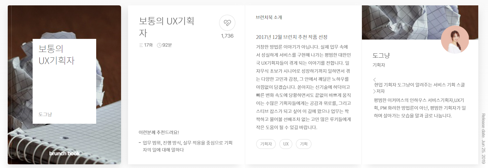
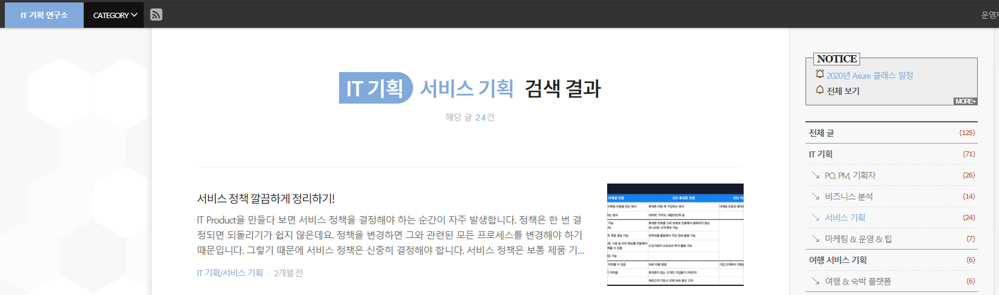
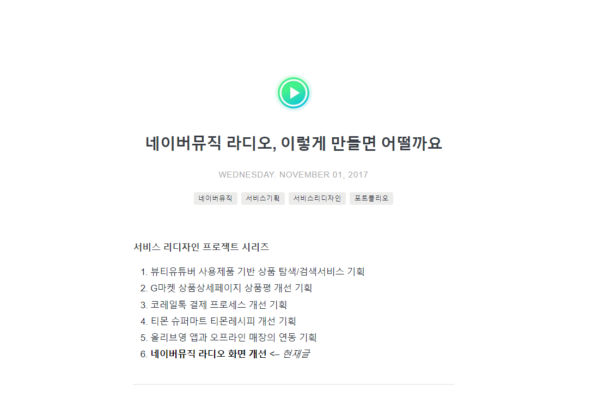
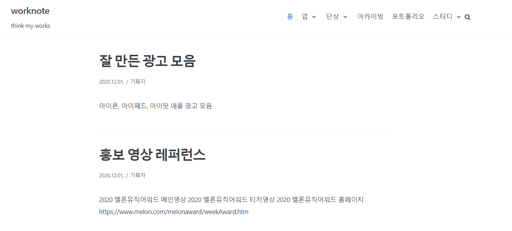
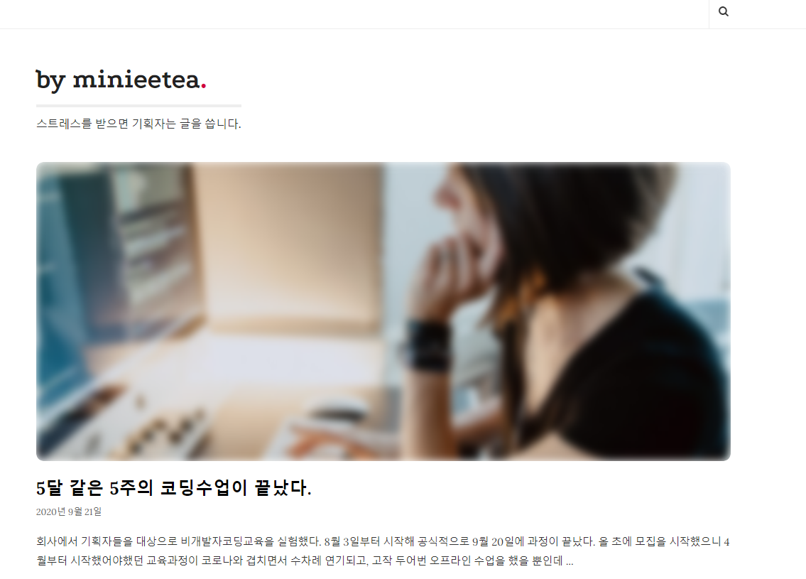
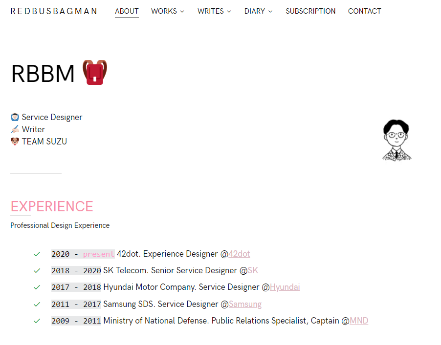

### 1. [보통의 서비스기획자 이야기](https://brunch.co.kr/magazine/uxsuperrookie)

도그냥님이 쓰신 글은 다 읽어봤다. 쓰신 책도 구매해서 정리하며 읽었다. 공부하다가 막히면 틈틈 꺼내본다. 

위 브런치 매거진도 필수
  

### 2. [IT 기획 연구소](https://yslab.kr/)

비즈니스 분석 관련해서 공부를 할 때 알게 되었던 사이트. 서비스기획, 비즈니스 등 기획 관련해서 좋은 글들이 많다. 유튜브도 운영하시는데 당연히 구독. Axure 툴 기초 강좌는 설명이 잘 되어있어서 툴에 대한 두려움이 사라질 정도.

  

### 3. [imyeonn님의 깃허브 블로그](https://imyeonn.github.io/)

IA가 잘 이해 안 될 때 헤매다가 이 블로그를 찾았다. 깃허브 블로그도 이 분 글을 보고 시작하게 됐고, 이커머스 관련 어떻게 공부하시는지 도움이 많이 됐던 사이트. 

### 4. [worknote](https://think-my.works/)

짧은 기록들을 남겨두시지만 생각하게 되는 인사이트가 많은 곳. 기록이 이렇게나 중요하다. 어떤 관점으로 관찰하시는지 매우 궁금한 곳.

### 5. [by minieetea-스트레스를 받으면 기획자는 글을 씁니다.](http://minieetea.com/)

글 중에 '기획자는 필요없다.'가 있는데 대단히 통쾌한 글. 몇 번이나 봐도 재밌는 글들이 많다.

### 6. [redbusbagman](https://redbusbagman.com/)

디자이너 분들의 글도 많이 챙겨봐야겠다고 생각하다 추천받은 사이트. 너무나 유용하다. 읽다보면 관점이 넓어지는 기분을 느낀다.

