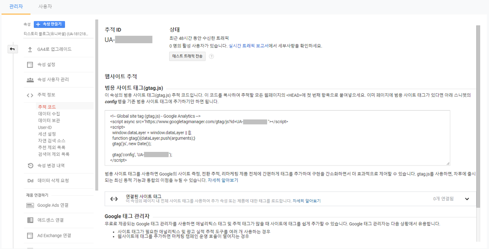
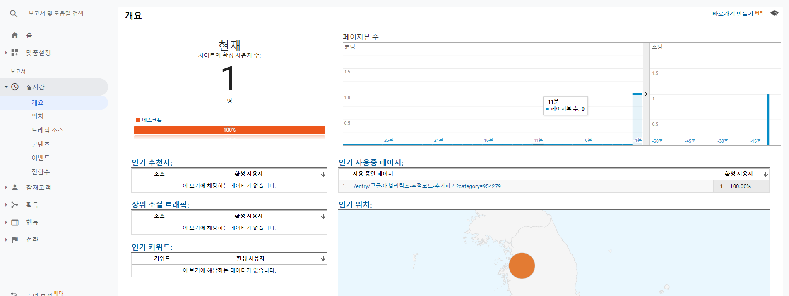

## Summary:
GA 추적 코드가 추가 되면 사용자의 행동 데이터를 확인 및 분석할 수 있다. 깃허브 블로그에는 아직 안 심어뒀는데 차근차근 추가해봐야겠다.


--- 

계정 생성 후, ```관리>속성>추적정보>추적코드``` 를 클릭하면 추적 ID와 추적 코드를 확인할 수 있다. 이 글을 쓰는 지금, GA4 기능이 베타 서비스 중인데 나중에 다뤄보고 유니버설 애널리틱스 속성화면으로 진행했다.

  

범용 사이트 태그를 복사해서 추적하려는 웹페이지의 ```<head>```의 제일 위에 추가하면 된다. 잘 설치되었는지 구글 태그 어시스턴트를 사용해도 되지만 제일 쉬운 방법은 구글 애널리틱스로 가서 실시간 사용자 데이터를 보면 된다. 



실시간 사용자에 데이터가 찍히면 GA 코드가 활성화됨을 알 수 있다.(만약, 안 잡힌다면 여러 이유가 있어서...) 아까 추적 코드가 있는 페이지로 가면 '테스트 트래픽 전송' 기능이 있는데 이를 사용해도 된다.

<span style="color:#FA5858">구글 애널리틱스를 공부할 때 많이 참고한 [사이트](https://analyticsmarketing.co.kr/)</span>
