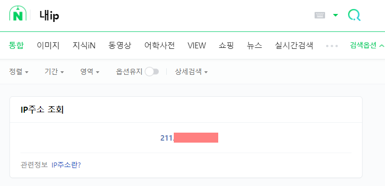
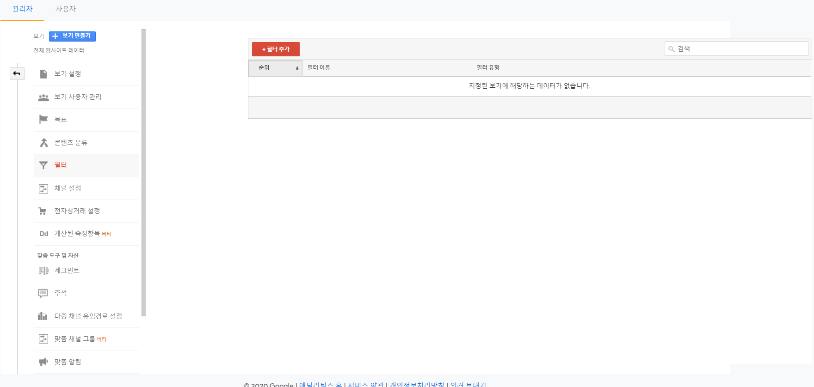
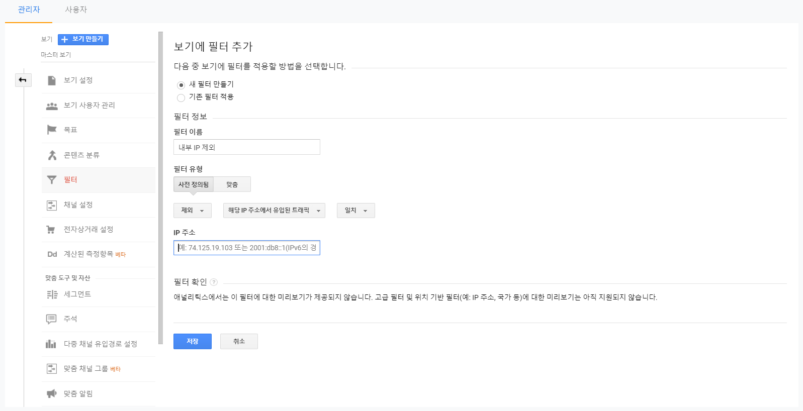
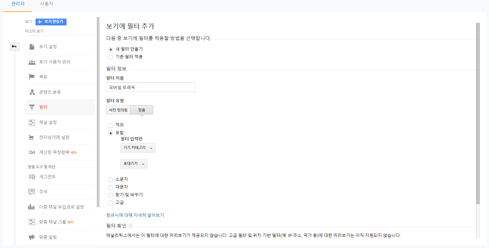

### Summary:
GA에 필터를 적용하여 원하는 데이터만 따로 볼 수 있게 할 수 있다. 필터가 적용이 되면 재처리가 불가능하기 때문에 '테스트 보기'에 먼저 적용 후에 실제 데이터를 뽑는 보기로 옮기는 것이 좋다. 여기선 기본적으로 세팅하는 필터인 내부 IP주소 제외랑 모바일과 PC유입을 구분하는 필터를 적용해봤다.

---

## 내부 IP 제외하기

내부 IP 필터를 적용하는 이유는 간단하다. 회사라면 내부 직원이, 집이라면 자신이 웹사이트에 들어가서 테스트를 하거나 어쩌다 그냥 들어갈 수도 있다. 수없이 들어갈 때도 있을텐데 내부 IP 제외가 걸려있지 않으면 무의미한 내부 트래픽이 잡혀 분석에 혼동을 줄 것이다. 그러니 내부 IP 제외는 필수! 

제외하기 위해서는 우선 내 IP 주소를 확인한다. 네이버에 '내 ip'로 검색하면 나온다.



나온 IP를 복사하여 ```관리 > 보기 > 필터``` 로 이동한다. 



필터 추가를 클릭하면 필터를 설정할 수 있는 화면이 나온다. 이름은 대략 '내부 IP 제외' 정도로 하고 필터 유형은 '사전 정의됨', 필터 유형 선택은 '제외', '해당 IP에서 유입된 트래픽', '일치'를 세팅한다. 그 다음 아까 가져온 IP 주소를 넣고 저장하면 끝.



---

## 모바일 기기 카테고리 필터

모바일/PC 기기를 구분하여 볼 수는 있긴 하지만 필터를 이용하면 따로 손 쓸 것 없이 편하게 기기 별로 데이터를 볼 수 있다. 아까처럼 필터 추가를 누르고 아래 이미지와 같이 설정하면 모바일 기기 카테고리 데이터만 따로 뽑아서 볼 수가 있다.



---

이건 알아두면 좋을 내용이라 가져왔다. 출처는 [여기](https://analyticsmarketing.co.kr/digital-analytics/google-analytics-basics/2313/)

![ga_filter_4](img/
