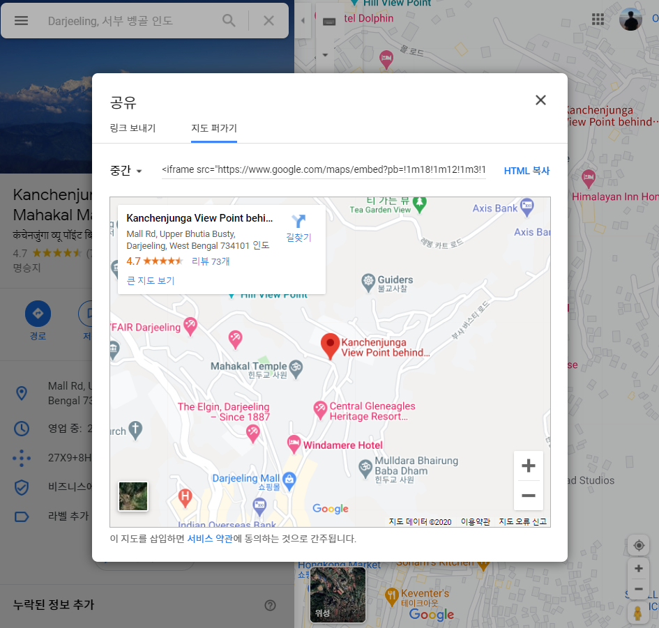

## Summary:
포스트 안에 유튜브 영상을 넣기 위해 샅샅이 뒤졌으나 실패했다. 비디오 관련 플러그인이 있는데 내가 뭘 잘못 건드린건지 아니면 이해가 부족해서 구현이 안된다. 그래서 답은 구글링이었다.

---

### 유튜브 영상

수많은 글들을 따라해도 실패하고 있을 때, 천금 같은 [포스팅](http://www.halryang.net/embed-youtube-responsively/)을 발견했다.(너무나 감사드립니다..) 내가 찾고 있는 ```포스트 내 재생 + 반응형```을 완벽하게 구현하셨다. 글을 따라 링크를 넣어봤으나 블로그대로 구분이 안됐다. OMG. 그래서 급하게(아님 멘탈이라도 잡기 위해) 적혀있는 사이트 [http://embedresponsively.com/](http://embedresponsively.com/) 로 가서 유튜브 링크를 넣으면 코드가 변형되어 나온다.

```
<style>.embed-container { position: relative; padding-bottom: 56.25%; height: 0; overflow: hidden; max-width: 100%; } .embed-container iframe, .embed-container object, .embed-container embed { position: absolute; top: 0; left: 0; width: 100%; height: 100%; }</style><div class='embed-container'><iframe src='https://www.youtube.com/embed/Cs2OJiF3d2M' frameborder='0' allowfullscreen></iframe></div>
```

그 결과는,

<style>.embed-container { position: relative; padding-bottom: 56.25%; height: 0; overflow: hidden; max-width: 100%; } .embed-container iframe, .embed-container object, .embed-container embed { position: absolute; top: 0; left: 0; width: 100%; height: 100%; }</style><div class='embed-container'><iframe src='https://www.youtube.com/embed/Cs2OJiF3d2M' frameborder='0' allowfullscreen></iframe></div>

---
### 구글맵

구글맵도 똑같이 해주면 된다. 다만 링크를 URL을 바로 복사해서 넣어주는게 아니라 공유 버튼 클릭 후, 지도 퍼가기 화면에 나오는 html 코드를 넣어야만 변형된다.



그걸 넣으면,

<style>.embed-container { position: relative; padding-bottom: 56.25%; height: 0; overflow: hidden; max-width: 100%; } .embed-container iframe, .embed-container object, .embed-container embed { position: absolute; top: 0; left: 0; width: 100%; height: 100%; }</style><div class='embed-container'><iframe src='https://www.google.com/maps/embed?pb=!1m18!1m12!1m3!1d3553.504192889468!2d88.26567311535227!3d27.045828783070363!2m3!1f0!2f0!3f0!3m2!1i1024!2i768!4f13.1!3m3!1m2!1s0x39e42ec109f5d81b%3A0xaa9ef65377a4a9b!2sKanchenjunga%20View%20Point%20behind%20Mahakal%20Mandir!5e0!3m2!1sko!2skr!4v1607171875457!5m2!1sko!2skr' width='600' height='450' frameborder='0' style='border:0;' allowfullscreen='' aria-hidden='false' tabindex='0'></iframe></div>
